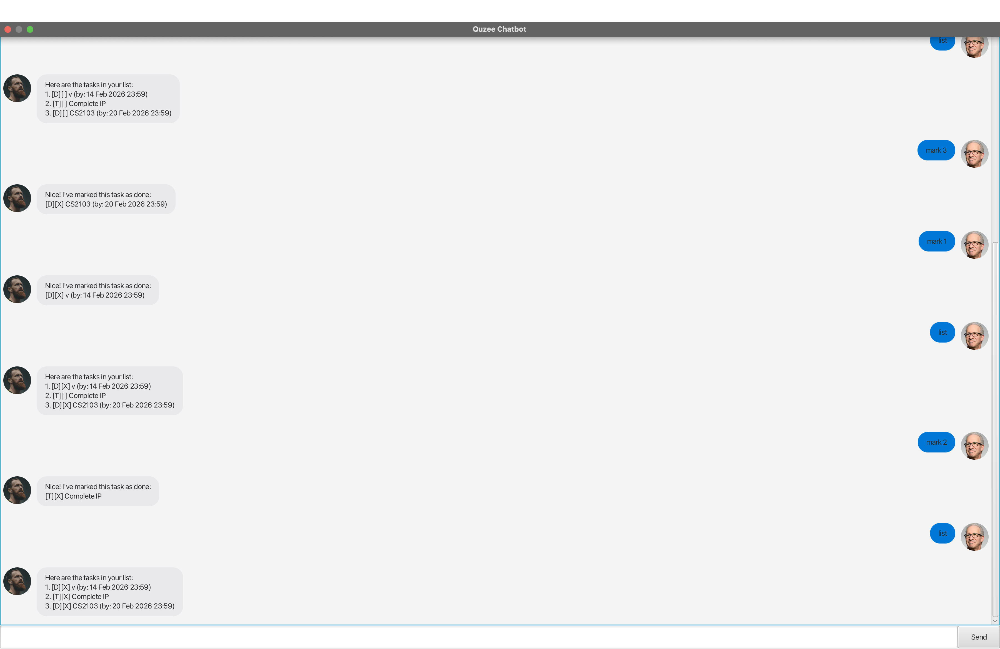

# Quzee User Guide

Quzee is an interesting task management chatbot!

---

## Features

### Planning a To-Do: `todo`
Adds a simple task without a specific timeline.

Format: `todo DESCRIPTION`

Example: `todo House Visiting during CNY`

### Setting a Deadline: `deadline`
Sets an task that must be completed by a specific time.

Format: `deadline DESCRIPTION /by DATETIME`
* `DATETIME` must be in the format `d/M/yyyy HHmm`.

Example: `deadline Complete CS2103 /by 20/2/2026 2359`

### Recording an Event: `event`
Records a task with a specific start and end time.

Format: `event DESCRIPTION /from DATETIME /to DATETIME`
* `DATETIME` must be in the format `d/M/yyyy HHmm`.

Example: `event Midterm /from 2/3/2026 1230 /to 2/3/2026 2030`

### Viewing your Tasks: `list`
Displays all the tasks currently in your list.

Format: `list`

### Finding Tasks: `find`
Searches tasks by searching for specific keywords.

Format: `find KEYWORD [MORE_KEYWORDS]`

Example: `find CS2103`

### Marking Progress: `mark`
Marks a task as completed.

Format: `mark INDEX`
* Marks the task at the specified `INDEX`. The index refers to the number shown in the displayed task list.
* The index **must be a positive integer** (1, 2, 3, …).

Example: `mark 1`

### Reversing Progress: `unmark`
Marks a task as not yet completed.

Format: `unmark INDEX`

### Clearing a Task: `delete`
Permanently removes a task from your list.

Format: `delete INDEX`
* Deletes the task at the specified `INDEX`.

Example: `delete 2`

### Exiting Quzee: `bye`
Saves all your progress and closes Quzee.

Format: `bye`

---

## FAQ

**Q**: How do I enter dates? 
**A**: Quzee strictly follows the `d/M/yyyy HHmm` format. Non-existent dates (like Feb 30) will be rejected.

**Q**: Where is my data saved? 
**A**: Your events are safely stored automatically in `data/quzee.txt`.

---
